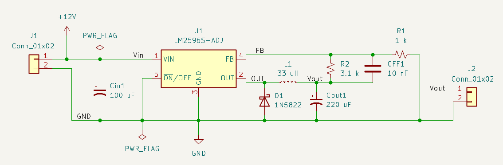
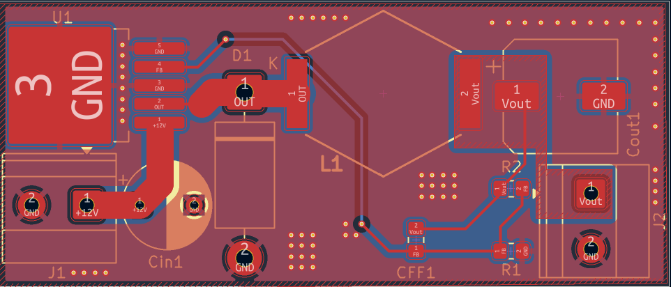
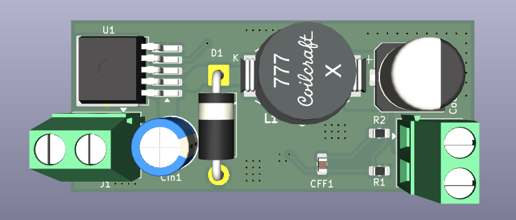

# LM2596 Buck Converter

## Overview
This project is a DC-DC buck converter designed using the LM2596.
It steps down a 12V input voltage to a regulated 5V output.
The circuit is designed and implemented in KiCad, including both schematic and PCB layout.

## Working Principle
The LM2596 operates as a switching regulator.
It rapidly switches the internal transistor on and off, transferring energy through the inductor.

-When the switch is ON, energy is stored in the inductor.
-When the switch is OFF, the stored energy is delivered to the load through the diode.
-The output voltage is regulated using a feedback network (R1 and R2).

## Components
- LM2596 switching regulator
- Schottky diode
- 33µH power inductor
- Input capacitor
- Output capacitor (low ESR)
- Feedback resistors (R1, R2)
- Compensation capacitor (CFF)
- Input and output connectors

## Images

### Schematic

### PCB Layout

### 3D View

## Design Notes
- Power traces are widened to handle higher current.
- A ground plane is used to improve stability and reduce noise.
- The switching node (L1–D1 connection) is kept as small as possible.
- Output capacitor is placed close to the inductor.
- Feedback path is kept short and away from noisy areas.

## Tools Used
- KiCad
- KiCad PCB Editor
- KiCad 3D Viewer

## Project Files

You can find the complete KiCad project files in the `kicad` folder, including schematic and PCB layout.

## Production Files

[Download Gerber Files](https://github.com/yusufislamyakin/LM2596-Integrated-Circuit/raw/main/gerber/gerber.zip)
